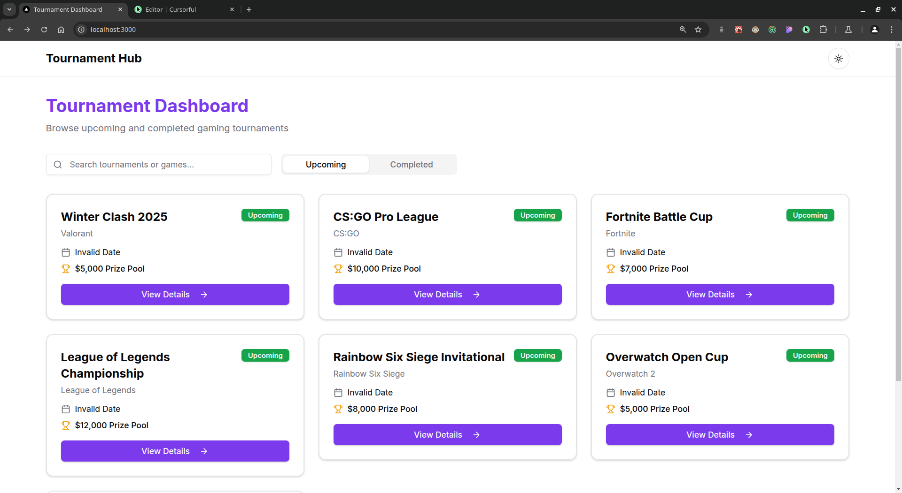
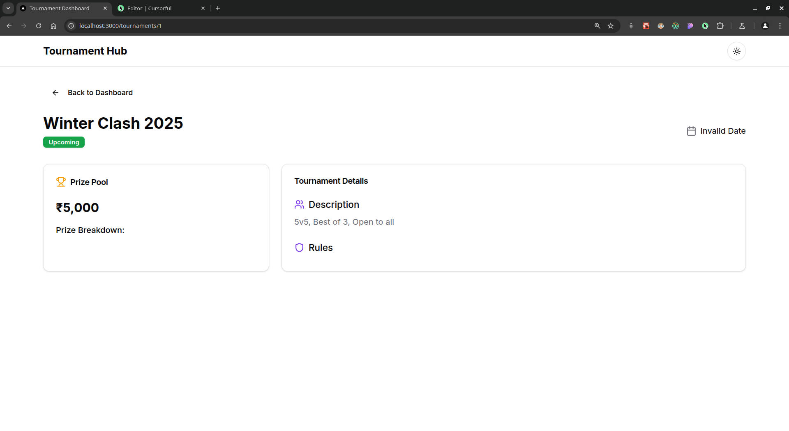
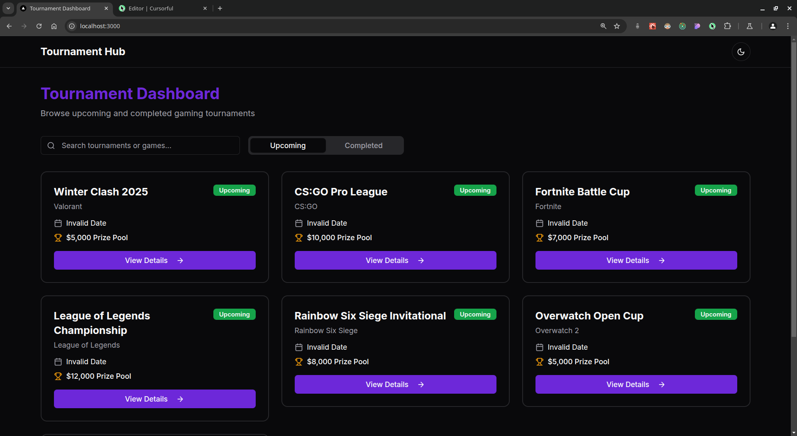

# GameHok Tournament Platform

## Overview
GameHok Tournament Platform is a full-stack web application that enables users to view and manage gaming tournaments. The project consists of a **Next.js** frontend and a **Spring Boot** backend with **PostgreSQL** as the database.

## ScreenShots

### Home Page
 

### Details Page
 

### Dark Mode
 

## Tech Stack

### Frontend:
- **Framework**: Next.js (TypeScript)
- **Styling**: Tailwind CSS
- **State Management**: React Hooks
- **API Requests**: Fetch API / Axios

### Backend:
- **Framework**: Spring Boot (Java)
- **Database**: PostgreSQL
- **ORM**: Spring Data JPA
- **Build Tool**: Maven

## Features

### **Frontend (Next.js + TypeScript)**
- **Tournament Dashboard**:
  - Displays a list of gaming tournaments (Title, Game Name, Date, Prize Pool, Status)
  - Filter tournaments by "Upcoming" and "Completed"
  - View tournament details on a dynamic page (`/tournaments/[id]`)
  
- **UI Components**:
  - Custom **Tournament Cards**
  - Theme Toggle (Light/Dark Mode)
  - Responsive and mobile-friendly design

### **Backend (Spring Boot + PostgreSQL)**
- **API Endpoints:**
  - `GET /api/tournaments` - Fetch all tournaments
  - `GET /api/tournaments/{id}` - Fetch tournament details
  - `POST /api/tournaments` - Create a new tournament (Optional)
- **Database Schema**:
  - `id (UUID)`, `title`, `game_name`, `date`, `prize_pool`, `status`, `description`
- **Seed Data**: 5 sample tournaments inserted at startup

## Project Structure
```
.
├── api (Spring Boot Backend)
│   ├── src/main/java/com/gamehok/api
│   │   ├── ApiApplication.java
│   │   ├── tournaments
│   │   │   ├── TournamentController.java
│   │   │   ├── Tournament.java
│   │   │   ├── TournamentRepository.java
│   │   │   └── TournamentService.java
│   ├── src/main/resources
│   │   ├── application.properties
│   └── pom.xml
├── client (Next.js Frontend)
│   ├── app/tournaments/[id]/page.tsx
│   ├── components/tournament-card.tsx
│   ├── lib/utils.ts
│   ├── next.config.mjs
│   ├── package.json
│   ├── tailwind.config.ts
│   └── tsconfig.json
```

## Setup Instructions

### **Backend (Spring Boot + PostgreSQL)**
#### Prerequisites:
- JDK 17+
- PostgreSQL installed & running

#### Steps:
1. Clone the repository and navigate to the backend folder:
   ```sh
   git clone https://github.com/YOUR_GITHUB_USERNAME/gamehok-tournament.git
   cd gamehok-tournament/api
   ```
2. Update `src/main/resources/application.properties` with your PostgreSQL credentials:
   ```properties
   spring.datasource.url=jdbc:postgresql://localhost:5432/gamehok_db
   spring.datasource.username=your_username
   spring.datasource.password=your_password
   ```
3. Run the application:
   ```sh
   ./mvnw spring-boot:run
   ```

### **Frontend (Next.js + TypeScript + TailwindCSS)**
#### Prerequisites:
- Node.js 18+

#### Steps:
1. Navigate to the frontend folder:
   ```sh
   cd ../client
   ```
2. Install dependencies:
   ```sh
   npm install
   ```
3. Start the development server:
   ```sh
   npm run dev
   ```
4. Open `http://localhost:3000` in your browser.

## API Endpoints
| Method | Endpoint               | Description               |
|--------|------------------------|---------------------------|
| GET    | /api/v1/tournaments       | Fetch all tournaments    |
| GET    | /api/v1/tournaments/{id}  | Fetch a tournament by ID |
| POST   | /api/v1/tournaments       | Create a new tournament  |
